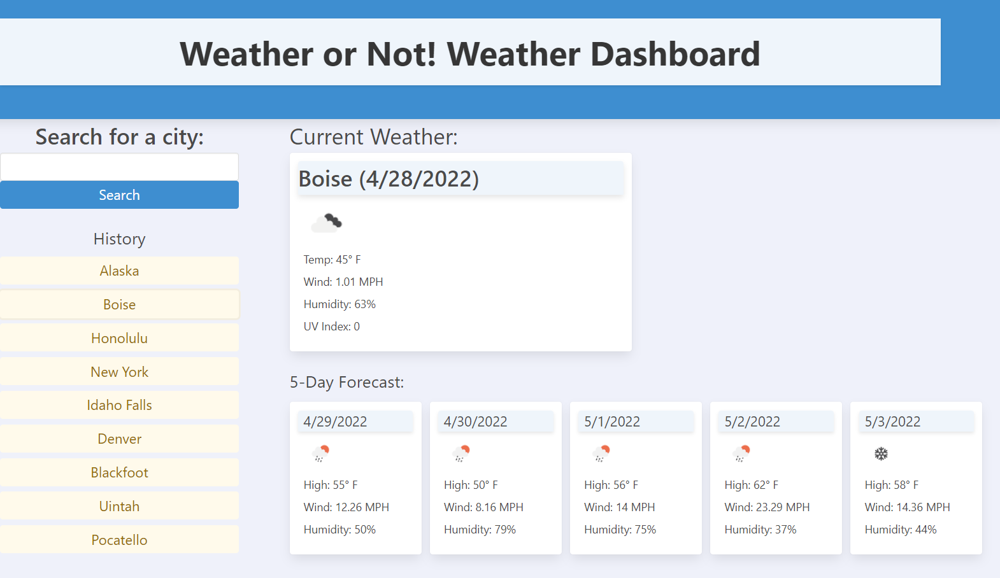

# Weather or Not! Weather Dashboard

## Description
This weather dashboard combines two api calls, both from openweathermap.org. One to get the coordinates and names of searched locations, the other to get current and future weather data of said locations. Users can be reminded of previous searches by looking at the history section.

## Future Improvements
* Dynamically created elements for 5-day forecast
* Tweaks to timezone logic to allow the display of the time for each locale
* Better integration of Bulma

## Credits
Used Bulma as a css framework.

## Link to Deployed Application
<a href = "https://mjzabriskie.github.io/weather-or-not/">https://mjzabriskie.github.io/weather-or-not/</a>

## Screenshot
